# RC PLANE 

- inspired by :

[RC-Pano](https://www.rcpano.net/2025/09/30/make-a-flying-wing-with-simple-materials-diy-rc-plane-remote-control/)

### Transmetteur pour avion RC, 3 channel, 1 moteur et 2 servo. ESP32, NRF24L01 et OLED integré.

## Revue de code : 
    - Changement du Vtail pour un pilotage basic ( gouvernaille et profondeur).
Adapté à l'ideaspark, optimisation du mappage des joysticks pour les plages de l'ESP32, ajout de messages d'erreur pour le NRF24L01, amélioration de l'affichage des commandes, et préparation pour les futures améliorations du circuit.

## Conception du circuit : 
    - Sécurité des GPIO, retracage des pin pour sécuriser et optimiser les tension selon le module, notamment l’ alimentation 7.4V réduit à 3.3V pouir le NRF24L01, ajout de condensateurs de découplage. Protection contre les interférences électromagnétiques à venir...

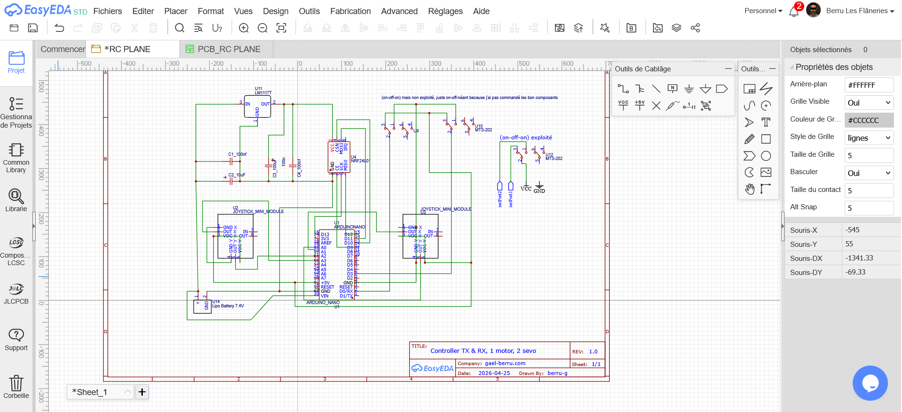

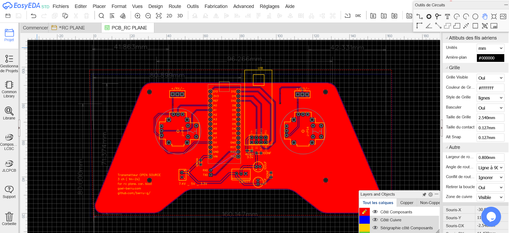

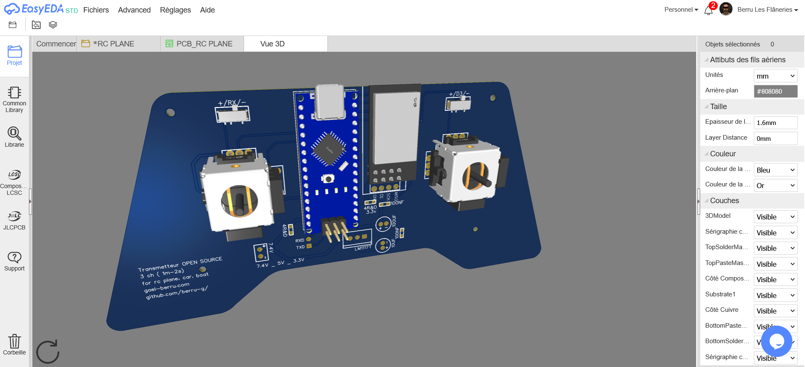

# Émetteur et Récepteur :

- Ajout d'un circuit pour voir le niveau de la batterie, pin pour R&D, optimisation des pertes probable de tension et de courant. Ajout de connectique optionnel pour condo et resistance si besoin. Ajout de connectique libre pour souder deux connections existante si besoin de faire du debug ou de la R&D.

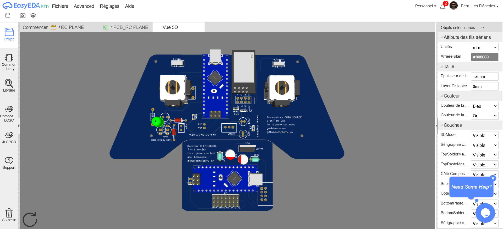

**Pour des raisons économique j'abandonne la coupe en forme de manette pour l'émetteur,  puis ajoute le recepteur sur le meme pcb avec un trait de coupe pour les séparer.**

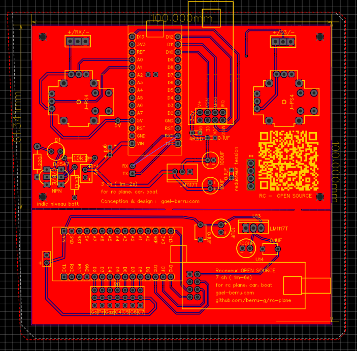

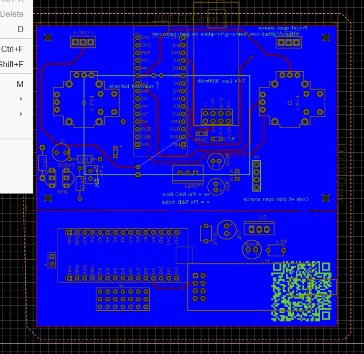

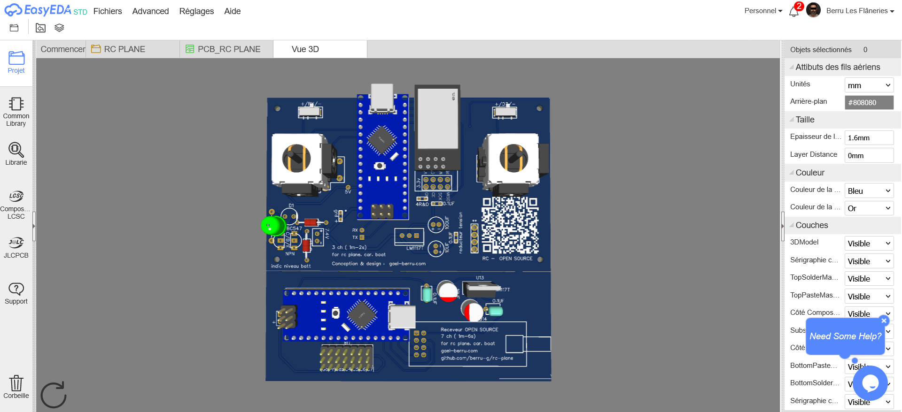

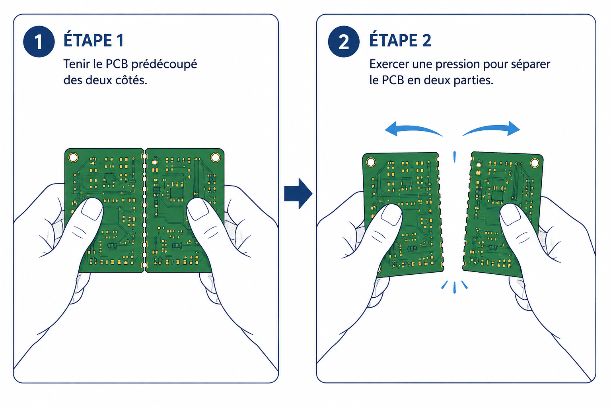

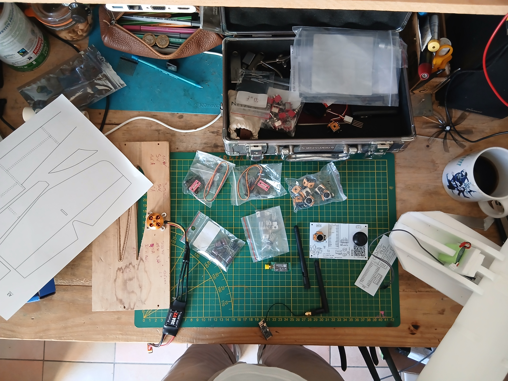

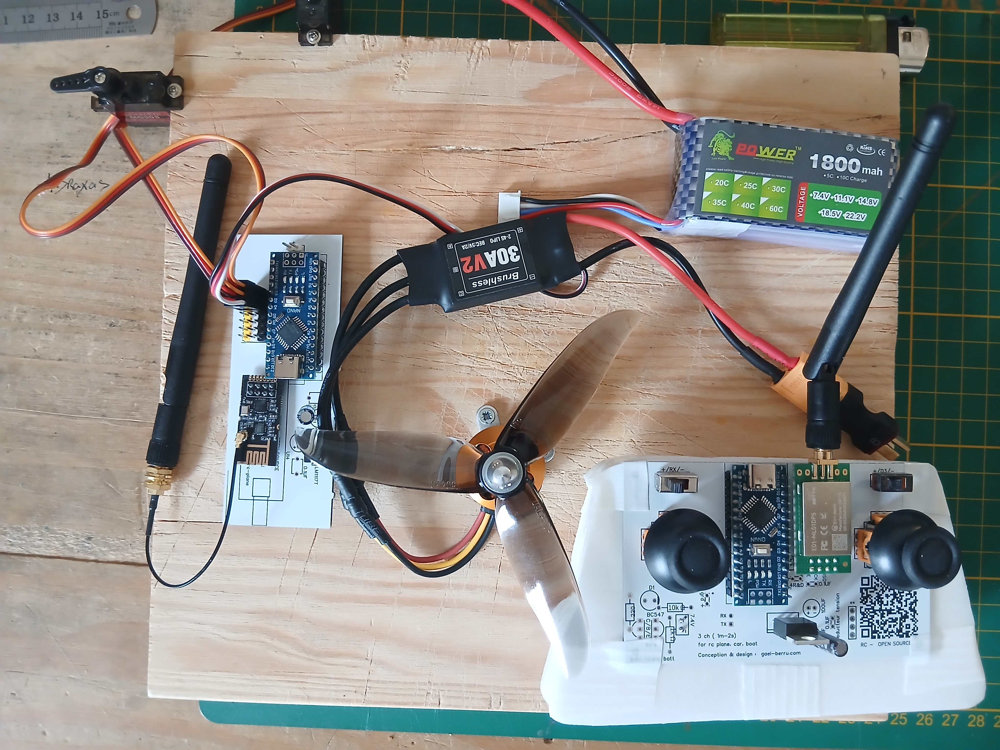

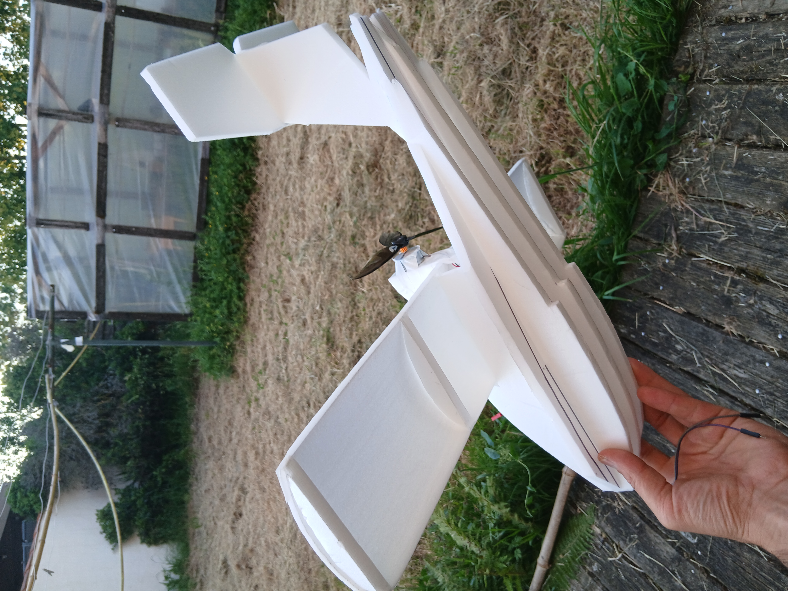

# Plan de l'avion a venir:

Voir ddasn RC-PLANE/CNC

## Création d'un modele miniature inspiré du Savoie S 21 du film Porco Rosso.

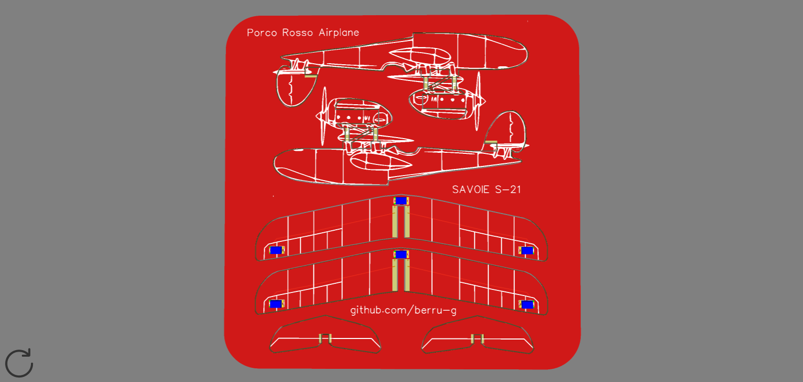
